# Diagram Bab 4

Diagram-diagram berikut disusun untuk menggantikan placeholder kosong pada Bab 4.
Seluruh diagram diselaraskan dengan implementasi sistem yang ada pada project saat ini.

## Gambar 4.1 Use Case Diagram Iterasi Satu

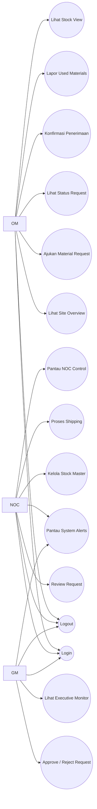

## Gambar 4.2 Activity Diagram Login

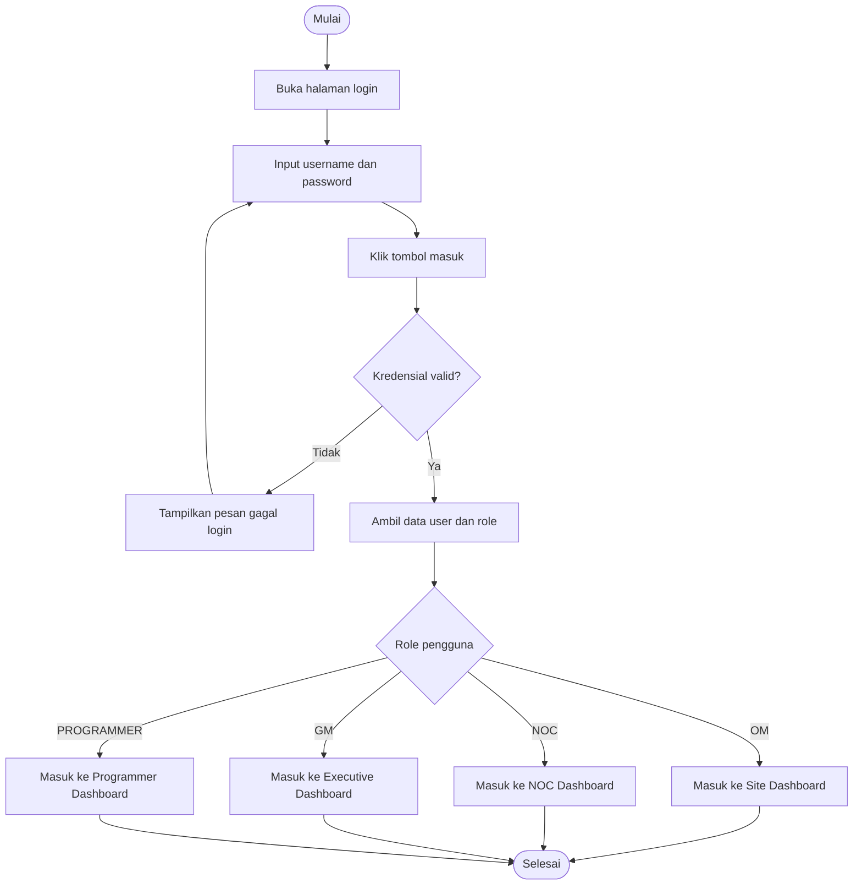

## Gambar 4.3 Activity Diagram Material Request oleh OM

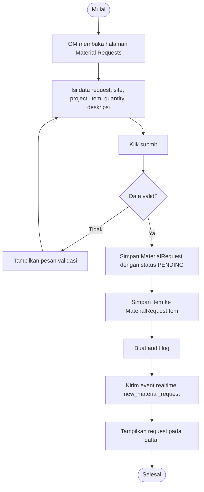

## Gambar 4.4 Activity Diagram NOC Technical Review

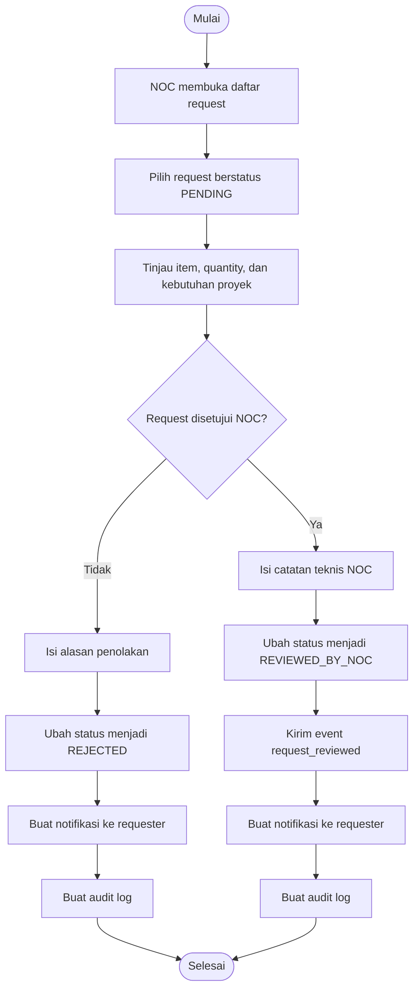

## Gambar 4.5 Activity Diagram Persetujuan GM

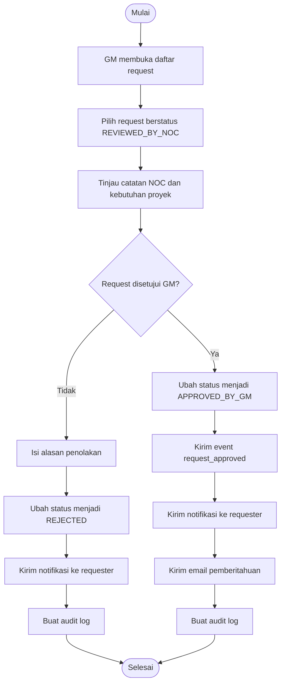

## Gambar 4.6 Activity Diagram Shipping Control

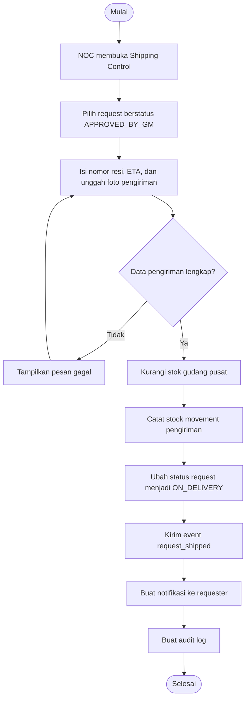

## Gambar 4.7 Activity Diagram Konfirmasi Penerimaan

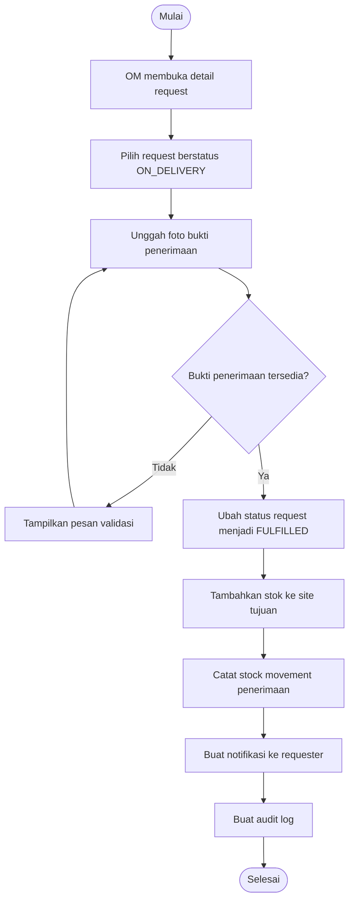

## Gambar 4.8 Activity Diagram Used Materials

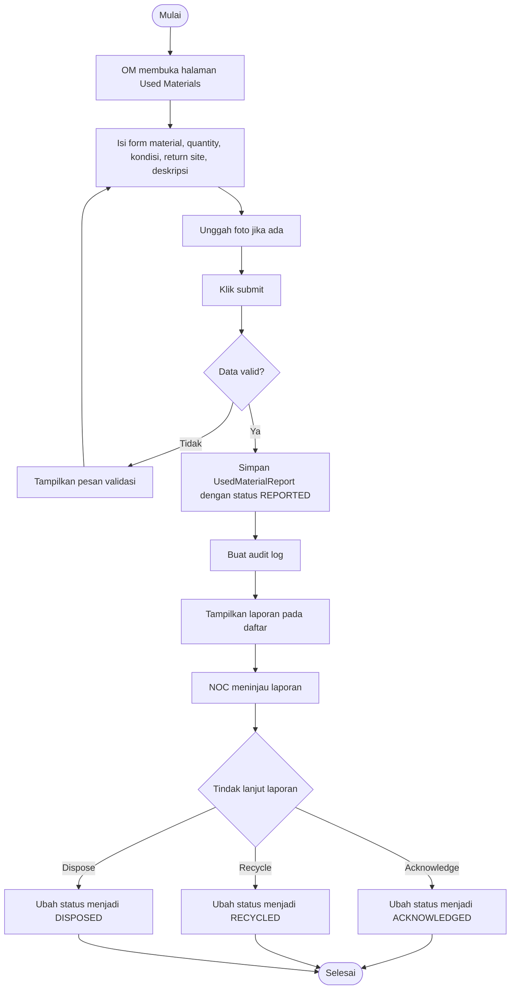

## Gambar 4.9 Activity Diagram Auto-Alert Stok Kritis

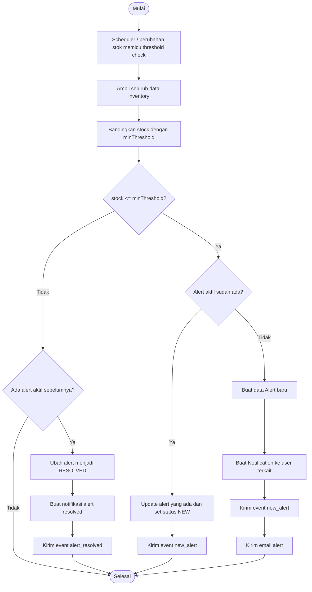

## Gambar 4.10 Activity Diagram Logout

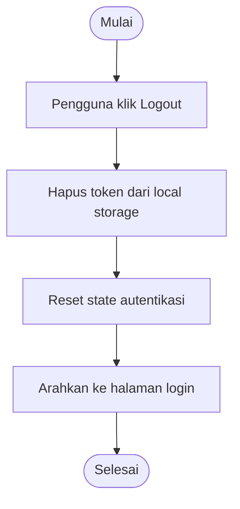

## Gambar 4.11 Class Diagram Iterasi Satu

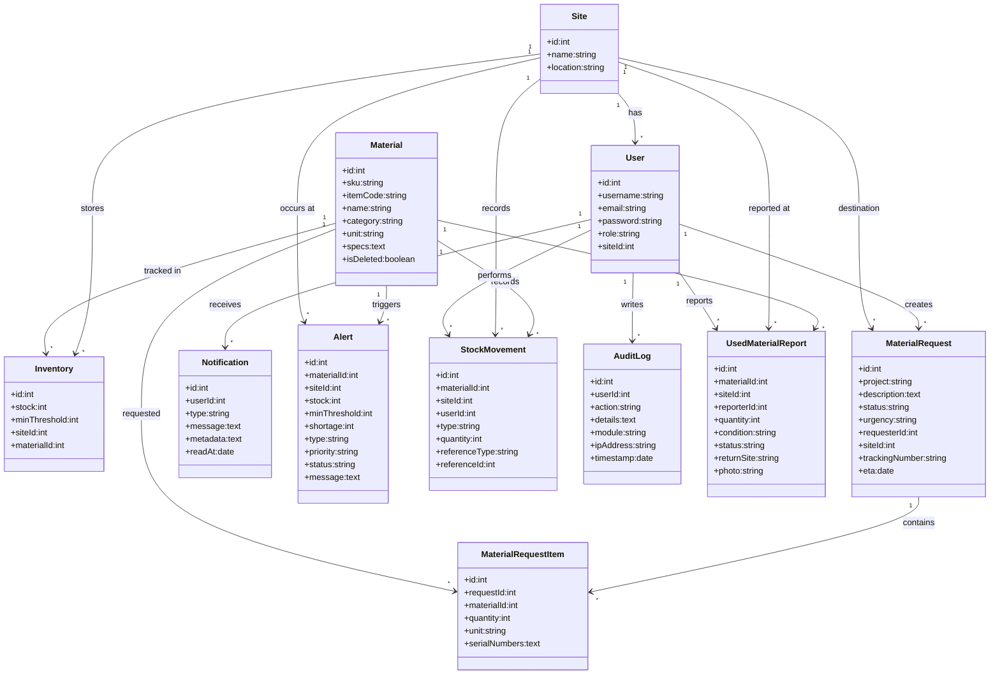

## Gambar 4.12 Relational Model Data

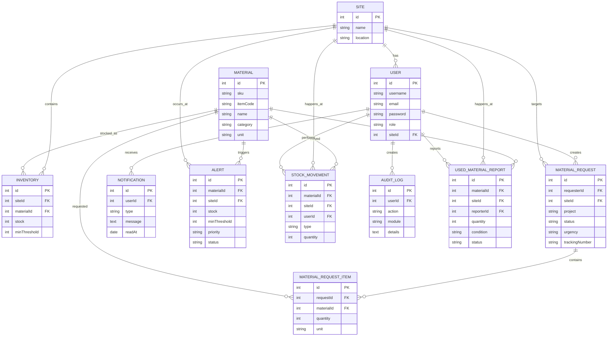

## Gambar 4.39 Activity Diagram Notifikasi GM & NOC

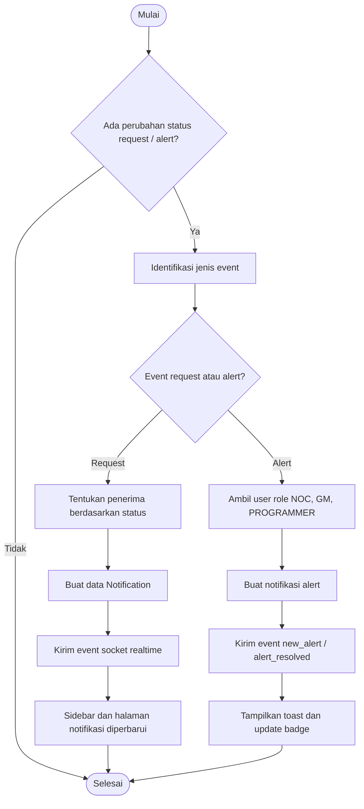

## Gambar 4.40 Activity Diagram Return Barang Rusak

Diagram ini disesuaikan dengan implementasi aktual pada modul `Used Materials / UsedMaterialReport`.

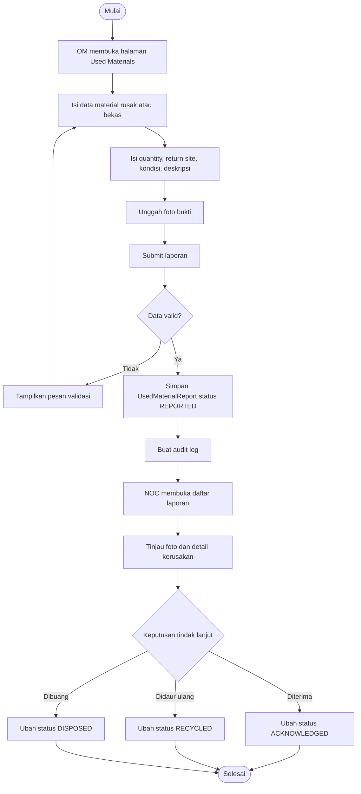

## Gambar 4.41 Activity Diagram Laporan

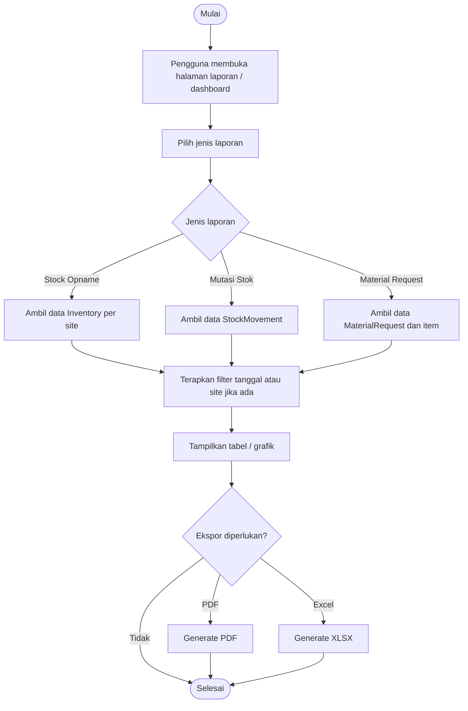
